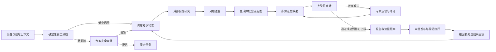

# LangGraph_Agent_Work 项目功能介绍与完善扩展分析报告

> 项目目录：`LangGraph_Agent_Work`  
> 分析依据：当前源码、Web 前端、配置、测试、CI、Docker 与项目文档  
> 核对日期：2026-07-17  
> 说明：本文描述的是当前仓库真实实现，不把 `main.py` 中尚未闭环的实验设想计入正式能力。

## 一、执行摘要

### 1.1 项目定位

本项目是一个面向工业设备故障诊断与维修决策支持的 LangGraph Agent 系统。它以一次“诊断任务”为业务主线，将设备与工况信息、企业受控 SOP、内置故障知识、历史维修案例、外部网络研究、大模型推理、安全审批、专家反馈和流程发布组织为一条可追踪的工作流。

系统的主要交付物不是普通聊天答案，而是：

- 可执行、可校验、可修订的 Mermaid 故障排查流程；
- 包含安全要求、诊断上下文、内外部证据和审计结果的诊断报告；
- 可回填真实根因与处理结果的历史案例；
- 可审批发布的流程版本；
- Word、PDF 和现场检查单等业务产物。

### 1.2 当前成熟度结论

当前项目已经从“LangGraph 技术原型”发展为“适合单企业、单实例、有人监督的受控试点系统”，但还不是可以直接横向扩展、无人值守运行的企业级生产平台。

综合判断如下：

| 维度 | 当前判断 | 主要依据 |
| --- | --- | --- |
| 核心诊断链路 | 试点可用 | 主图、内外检索、生成、审计、反馈、保存均已闭环 |
| 人机协同 | 试点可用 | 支持安全审批、逐问题反馈、暂停和恢复 |
| 知识管理 | 试点可用 | 支持受控文档、版本、权限、适用范围、Milvus 与降级检索 |
| 任务与流程治理 | 试点可用 | 任务中心、状态、重试、取消、流程版本与审批已实现 |
| 安全与权限 | 具备基础治理 | 有确定性安全门、RBAC、租户隔离，但尚缺企业级身份与安全规则治理 |
| 可观测与部署 | 具备基础能力 | Docker、健康检查、Prometheus 文本指标、Langfuse 可选接入 |
| 分布式与高可用 | 未完成 | SQLite、进程内协调和请求内执行只适合单实例 |
| 质量证明 | 起步阶段 | 自动测试较完整，但真实工业黄金集仅有很小的安全规则基线 |
| 企业系统集成 | 起步阶段 | 仅有通用资产导入和文件导出，尚未形成 CMMS/EAM/SCADA 闭环 |

### 1.3 本次实际验证

本次使用仓库对应的 Python 3.10 环境执行：

```text
python -m pytest -q tests -p no:cacheprovider
结果：54 passed，10 warnings

python evaluation/run_p0_evaluation.py
结果：4 cases，4 passed
```

10 条警告均与 PyMilvus ORM 风格 API 将在 PyMilvus 3.1 移除有关，不是当前测试失败，但应纳入近期技术债。

默认 shell 当前指向 Python 3.7.3，不满足项目要求；项目应继续明确并自动检查 Python 3.10+，避免使用错误解释器造成误判。

## 二、项目解决的业务问题

工业故障诊断通常面临四类问题：

1. SOP、维修手册和专家经验分散，检索效率低且版本难治理。
2. 单纯依赖大模型容易产生无依据步骤，难以说明每一步来自哪里。
3. 高风险现场操作不能由 AI 自由生成后直接执行，必须设置安全规则与人工审批。
4. 一次诊断结束后，真实根因、处理结果和专家修改没有沉淀，系统无法持续改进。

本项目已经围绕这四类问题建立初步闭环：



## 三、系统总体架构

### 3.1 技术组成

| 层次 | 主要技术或文件 | 职责 |
| --- | --- | --- |
| 交互层 | `static/app.html` | 登录、诊断输入、任务中心、资产/SOP/流程/看板操作 |
| API 层 | `web_server.py`、FastAPI、SSE | 请求校验、流式事件、权限控制、任务和业务 API |
| Agent 编排层 | `fault_agent.py`、LangGraph | 安全门、检索、融合、生成、审计、中断与修订 |
| 外部研究层 | `research/` | 研究契约、预算、基础/主管研究图和搜索提供商 |
| 知识层 | `managed_knowledge_vector.py`、`business_store.py`、Milvus | SOP、案例、向量检索、版本和租户元数据 |
| 运行时层 | `checkpointing.py`、`runtime_store.py` | checkpoint、任务状态、TTL、事件和恢复 |
| 质量与治理层 | `safety.py`、`security.py`、`governance.py` | 安全规则、RBAC、会话、限流与并发 |
| 交付层 | `mcp_tools.py`、`artifact_export.py` | 报告、流程图、记忆、Word/PDF/检查单 |
| 运维层 | `Dockerfile`、`docker-compose.yml`、`.github/workflows/ci.yml` | 构建、单实例部署、测试和容器 smoke test |

### 3.2 主 LangGraph 工作流

当前主图包含 13 个业务节点：

```text
dispatch
  -> assess_safety
  -> safety_gate
      -> 拒绝：END
      -> 批准/无需审批：start_research
          -> retrieve_internal ┐
          -> external_research ┴-> filter
              -> generate
              -> map_evidence
              -> audit
                  -> 通过：END
                  -> 有缺口：evaluate_questions
                      -> ask_expert（逐题循环）
                      -> refine
                      -> map_evidence -> audit
```

其中内部检索和外部研究采用 fan-out/fan-in；高风险审批与专家问答使用 LangGraph `interrupt()` 暂停，并通过持久化 checkpoint 恢复。

## 四、现有功能介绍

### 4.1 结构化诊断输入与设备资产

用户除自由文本故障描述外，还可以提交：

- 设备资产、设备类型、厂商、型号、固件和安装位置；
- 报警码、发生工况、维修历史；
- 电流、电压、温度、振动等测点；
- 简单测点值或带单位的 `{value, unit}` 结构。

设备资产支持上下级关系、序列号、关键度、状态与扩展 metadata。`measurement_template` 可定义测点单位和正常上下限，系统会标注越界情况并按设备形成历史趋势。

系统还提供 CMMS/EAM/ERP 通用幂等导入接口，可按租户和设备编号新增或更新资产。但它目前属于数据导入桥，不是与外部系统双向实时同步。

### 4.2 工业安全预检与人工门禁

在知识检索和模型调用之前，`safety.py` 使用确定性规则评估风险，当前覆盖：

- 高压、带电、电弧和母线；
- 可燃、爆炸、燃气和泄漏；
- 高温、蒸汽和压力能量；
- 旋转机械；
- 旁路保护、屏蔽联锁和强制输出；
- 受限空间、有毒和缺氧；
- 关键设备最低风险提升。

高风险任务必须由 expert/admin 显式批准，否则工作流在任何检索和 LLM 推理前停止。审批信息、操作者和任务事件会保存，形成基础审计链。

这一能力显著优于仅用提示词约束模型，但当前规则仍是代码内置的关键词/正则规则，还不能替代企业 HSE 制度、作业票、电子签名和现场资质核验。

### 4.3 内部知识检索

内部检索融合三类来源：

1. `industrial_fault_knowledge`：由 `sop_documents.py` 初始化的内置故障知识。
2. `managed_sop_knowledge`：企业上传并治理的受控 SOP 向量集合。
3. 历史诊断案例：已回填根因、解决方案、结果与可信度的维修案例。

受控 SOP 支持：

- txt、md、log、json、csv、tsv、PDF、DOCX、XLSX、XLSM；
- 安全解析、大小限制、文本提取与确定性分块；
- 文档版本、校验和、变更说明、生效/停用/归档；
- 最低角色权限和租户隔离；
- 设备类型、厂商、型号、固件与有效期等适用范围；
- 原文件保存、版本查看、增量索引和重新同步；
- Milvus 语义检索优先，异常时降级为 SQLite 文本相似度检索。

这套实现已经具备中小规模试点的知识治理骨架。主要限制是扫描 PDF 无 OCR、复杂表格/图纸解析有限、两套 SOP 集合仍并存，以及大规模索引的迁移与重建治理不足。

### 4.4 外部研究

外部研究由统一网关管理，Web/API 当前开放三种模式：

| 模式 | 用途 |
| --- | --- |
| `off` | 不访问互联网，只依赖内部知识 |
| `basic` | 单主题迭代检索、总结和反思 |
| `supervisory` | 拆解多个研究任务，分别执行后统一综合 |

可选搜索提供商包括 Tavily、DuckDuckGo、SearXNG 和 Perplexity。研究契约会记录来源、URL、摘要、查询次数、搜索调用量、状态和 warning，并控制：

- 研究深度；
- 最大任务数；
- 总搜索次数；
- 总时限；
- 外部上下文最大长度；
- URL 规范化与来源去重；
- 无依据 URL 清理和失败降级。

外部内容在融合提示中被明确标记为不可信数据，优先级低于内部 SOP，以减轻提示注入和不可靠来源覆盖企业规范的风险。

### 4.5 知识融合与诊断生成

系统以内部 SOP 为权威主框架，历史案例为经验补充，外部研究为参考信息。融合阶段要求：

- 内外部冲突时优先采用内部 SOP；
- 外部补充内容标注为参考；
- 剔除广告、重复和无关内容；
- 内部知识为空时提示外部信息未经现场验证；
- 将设备、工况、测点与安全控制加入诊断上下文。

融合结果再用于生成包含判断节点、正常/异常分支和结束条件的 Mermaid 排障流程。

### 4.6 Mermaid 生成、修复和校验

流程图不是生成后直接交付。`mermaid_pipeline.py` 会执行：

1. 提取 Mermaid 代码块；
2. 规范化源码；
3. 限制内容长度并过滤危险初始化指令；
4. 调用固定版本的官方 `mermaid.parse()`；
5. 语法错误时让模型做一次最小化修复；
6. 再次失败则终止，不保存未通过校验的结果。

Node 校验器采用常驻子进程，readiness 也会检查该组件，已经解决了旧版本反复冷启动和关键链路超时的问题。

### 4.7 证据映射、审计与专家修订

生成流程后，系统会把 Mermaid 节点映射到受控 SOP、历史案例和外部来源，输出证据 ID、位置、置信度、支持/冲突关系和需复核标记。

随后由审计节点检查：

- 流程是否完整覆盖主要原因；
- 判断节点是否具有完整分支；
- 操作是否明确、可执行；
- 是否存在逻辑矛盾或安全问题；
- 是否需要补充现场信息。

有缺口时，系统最多提出 3 个问题。自动模式由模型生成反馈；人工模式逐题中断，等待专家回答，再做局部修订并重新进行证据映射和审计，最多修订 3 轮。

当前证据映射主要依赖中文二元词和英文词项重叠，是确定性且易解释的基础实现，但不等同于严格的语义蕴含或法规级引用验证。

### 4.8 任务中心与运行恢复

任务中心支持：

- 草稿、排队、运行、待安全审批、待专家反馈、待流程审批、完成、失败、取消、拒绝、过期和归档等状态；
- 按状态、设备和关键词筛选；
- 分页、批量归档、取消和重试；
- 从任务中心恢复安全审批或专家反馈；
- 查看任务事件、流程版本和案例结果。

任务元数据保存在 SQLite，LangGraph checkpoint 可使用官方 SQLite Saver。等待反馈的任务可在服务重启后恢复；正在执行的第三方请求无法在进程崩溃后续跑，会转为 `interrupted` 并通过重试创建新任务。

取消是协作式取消：系统会在后续节点边界停止，但已经发出的 LLM 或搜索请求仍可能运行到自身超时。

### 4.9 流程编辑、版本审批和案例闭环

诊断完成后可创建流程版本，支持：

- Mermaid 源码编辑和实时预览；
- 文本 Diff 与逐个差异块采纳；
- 草稿、批准、拒绝和发布状态；
- 作者、审批人、变更说明和决定说明；
- 优先使用已发布版本导出现场文档。

现场处理完成后，专家可以回填确认根因、实际解决方案、处理结果、可信度和评分。已确认案例随后可进入下一次诊断召回，从而形成“诊断—执行—回填—复用”的业务闭环。

当前编辑器是源码编辑器，不是拖拽式流程设计器；审批也不是满足受监管行业要求的电子签名系统。

### 4.10 报告、导出与质量看板

系统可保存或导出：

- Mermaid `.mmd`；
- Markdown 报告；
- JSON 诊断记忆；
- Word `.docx`；
- PDF；
- 带 BOM 的现场检查单 `.csv`。

质量看板可按租户汇总任务量、审计通过率、专家修改率、案例成功率、平均耗时、平均修订次数、Token 和估算成本，并支持按设备和模型观察。

现有 Word/PDF 主要输出文字和 Mermaid 源码，尚未把渲染后的流程图、企业模板、签章、二维码和附件完整嵌入正式报告。

### 4.11 认证、权限与租户隔离

Web 支持用户名/密码登录和带签名的 HttpOnly、SameSite=Lax 会话 Cookie；机器系统可使用 API Key。角色包括 viewer、operator、expert 和 admin。

服务端会按角色控制发起任务、高风险审批、知识上传、流程决策和指标访问，并按 `tenant_id` 隔离资产、任务、知识、案例和产物。

这适合封闭网络中的受控试点，但企业生产仍需要 OIDC/SAML、MFA、统一账号生命周期、细粒度资源授权、密钥托管、会话吊销、CSRF 策略和不可篡改审计。

### 4.12 可观测性、健康检查与部署

项目已提供：

- `/health/live`：进程存活；
- `/health/ready`：任务库、业务库、checkpoint、知识向量、Mermaid 校验器和认证状态；
- `/metrics`：Prometheus 文本指标；
- 可选 Langfuse 调用追踪；
- Dockerfile、Compose、健康检查和 `output/` 数据卷；
- GitHub Actions：Python 编译、54 项测试、安全基线、Docker 构建与 readiness smoke test。

可观测性目前以进程内指标和可选追踪为主，尚缺统一结构化日志、跨服务 trace、持久化指标、告警规则与 SLO。

## 五、当前数据与存储边界

| 数据 | 当前存储 | 生产边界 |
| --- | --- | --- |
| 任务、事件、资产、知识元数据、案例、流程、指标 | SQLite `pilot.sqlite3` | 适合单实例；不适合多副本共享写入 |
| LangGraph 状态 | 内存或 SQLite checkpoint | 生产默认 SQLite；横向扩展需集中式后端 |
| 受控 SOP 原文件 | `output/knowledge` | 需对象存储、版本保留、病毒扫描与备份策略 |
| 受控 SOP 向量 | Milvus/Zilliz 或本地 Milvus Lite | 大规模需容量规划、迁移、重建与一致性监控 |
| 内置 SOP | 独立 Milvus 集合 | 与受控知识并存，治理口径不统一 |
| 流程图、报告、记忆 | 本地文件目录 | 多实例需对象存储和统一授权下载服务 |
| 运行指标 | 进程内聚合及 SQLite 业务统计 | 需 Prometheus/日志平台长期留存 |

## 六、当前主要问题与待完善功能

### 6.1 P0：扩大生产试点前必须完成

#### P0-1 分布式任务执行与集中式持久化

当前 SQLite、进程内 `_sessions`、本地文件和请求内线程执行共同限制了横向扩展。建议：

- checkpoint 和业务库迁移到 PostgreSQL 等集中式后端；
- 引入持久化 Job Queue/Worker，SSE 只订阅事件；
- 将产物迁移到对象存储；
- 建立幂等开始、幂等 resume、任务租约、心跳和孤儿任务回收；
- 明确定义崩溃恢复、重试和第三方调用去重策略。

验收标准：至少两副本部署下任务不丢失、不重复执行，任一实例重启后等待审批任务可以继续。

#### P0-2 企业身份、安全与审计加固

建议补充：

- OIDC/SAML 单点登录、MFA 和企业目录同步；
- 账号停用、会话吊销、登录失败锁定和密码策略；
- CSRF 防护、安全响应头、可信代理和严格 CORS；
- Secret Manager/KMS；
- 资源级授权和设备/产线范围权限；
- 审批、下载、知识版本和安全规则变更的不可篡改审计。

验收标准：完成威胁建模、权限矩阵测试、依赖与镜像扫描，并通过企业安全评审。

#### P0-3 工业安全规则产品化

当前代码内置规则适合作为第一道门，但覆盖面和治理能力不足。建议：

- 将安全规则版本化、可配置并关联设备类型、工厂和法规；
- 为每个步骤增加能量隔离、PPE、资质、工具和允许条件；
- 接入作业票/LOTO 系统，验证现场前置条件；
- 对旁路联锁、强制输出、带电操作等动作实施硬禁止策略；
- 支持双人复核和合规电子签名；
- 建立安全对抗测试与误放行率指标。

验收标准：由 HSE 与设备专家联合签署规则集，并用真实场景验证高风险漏检率。

#### P0-4 建立真实工业质量评测

当前安全黄金集只有 4 个案例，只能证明少量确定性规则没有回归，不能证明诊断正确。建议建设专家标注数据集，衡量：

- 根因 Top-K 命中率；
- 必需安全步骤召回率与误放行率；
- SOP 引用正确率和无依据步骤比例；
- 证据冲突识别准确率；
- 首次审计通过率和专家修改率；
- 完成率、耗时、Token、搜索量和成本；
- 不同模型、提示词、知识版本的回归差异。

验收标准：至少覆盖主要设备域、常见故障和高风险反例，并设置发布阻断阈值。

#### P0-5 数据备份、迁移和灾难恢复

当前数据库通过代码执行 `CREATE/ALTER`，尚无正式 schema migration 体系。建议引入迁移工具，制定 SQLite 到 PostgreSQL 的路径，并验证：

- 数据库、checkpoint、向量和原文件的一致性备份；
- 加密、保留周期、恢复演练和 RPO/RTO；
- 知识索引可重建、产物可校验；
- 租户删除、数据导出和合规留存。

### 6.2 P1：提升准确性与专家效率

#### P1-1 统一知识架构并升级检索

- 将内置 SOP 迁入受控知识体系，逐步取消双集合特殊逻辑；
- 采用向量 + BM25 + 元数据过滤 + reranker 的混合检索；
- 引入准确的段落坐标、页码、表格单元格和文档版本引用；
- 增加扫描 PDF OCR、图片和复杂表格解析；
- 建立 embedding 模型版本、批量重建、灰度切换和召回评测；
- 迁移 PyMilvus ORM API 到 `MilvusClient`，消除 3.1 弃用风险。

#### P1-2 提升证据与结论可信度

当前证据映射是词项重叠启发式。建议增加语义 rerank、自然语言蕴含/矛盾判断、引用原文定位和证据覆盖率门槛；无直接证据的高风险步骤不得直接进入发布状态。

同时建议采用不同模型或确定性规则完成生成与评审，降低同源模型“自我认可”的风险。

#### P1-3 可视化流程编辑器

实现拖拽节点、连线、分支标签、阈值字段、节点级评论、逐条接受/拒绝 AI 修改和拓扑校验。流程发布前应能查看“节点—证据—安全要求—审批记录”的完整链路。

#### P1-4 正式报告与现场执行闭环

- 将渲染后的 SVG/PNG 流程图嵌入 Word/PDF；
- 支持企业模板、Logo、页眉页脚、目录、编号和签章；
- 检查单支持移动端逐步执行、测量值校验、拍照和签名；
- 现场执行结果自动回写任务与案例，而不是依赖人工再次录入。

#### P1-5 多模态诊断输入

支持设备照片、铭牌、热成像、波形、振动频谱、PLC/驱动器日志和维修手册附件，并将解析结果作为带来源的结构化证据，而不是直接拼入提示词。

#### P1-6 前端与 API 工程化

当前前端集中在单个 `app.html`。建议组件化、类型化并增加：

- API 版本管理和 OpenAPI 契约发布；
- 表单草稿自动保存、断线重连和 SSE 事件续传；
- 无障碍、国际化、错误码与可恢复操作指引；
- 前端单元测试和端到端浏览器测试。

### 6.3 P2：形成差异化工业平台能力

1. **CMMS/EAM 双向集成**：对接 SAP PM、Maximo 等系统，读取设备和工单，回写诊断、备件与维修结果。
2. **OT 与时序数据接入**：通过 OPC UA、MQTT、SCADA 或时序数据库读取实时/历史测点。
3. **概率化根因推理**：随证据更新根因概率，明确支持证据、反对证据和信息增益最高的下一步检查。
4. **预测性维护**：从故障后诊断扩展到异常检测、趋势预警和检修窗口建议。
5. **工业知识图谱**：连接设备、部件、报警、根因、SOP、备件、案例和测点，提高跨源推理能力。
6. **专业 Agent/Skill 路由**：按机械、电气、仪表、PLC、网络等专业域调用独立流程和工具。
7. **边缘与离线部署**：支持隔离网、本地模型、离线知识包和延迟同步。
8. **仿真与数字孪生验证**：重要建议先在仿真环境或数字孪生中验证，再进入现场审批。

## 七、工程技术债

### 7.1 需要清理或隔离的遗留入口

- `main.py` 引用当前仓库不存在的 `Local_Model`、`Knowledge_Grpah`、`ContextRouter` 等模块，不能作为正式入口；
- `Milvus.py` 是另一套通用/旧版向量封装，与主诊断知识模型不同；
- `static/index.html`、Notebook 辅助脚本和若干测试填充脚本属于历史或开发工具；
- `fault_agent.py` 中存在重复定义的 `more_questions_router`，应收敛为一个实现。

建议将这些文件迁入 `experiments/` 或 `tools/legacy/`，并在 CI 中只检查正式运行入口。

### 7.2 文档一致性

项目文档存在版本不同步：例如 `docs/P1_功能使用与验收指南.md` 仍描述受控知识只采用 SQLite 文本检索，而当前代码与 README 已实现 Milvus 优先、SQLite 降级。旧《项目报告》也保留了“会话/checkpoint 仅存内存”等已经被修复的判断。

建议建立单一能力清单，通过版本号或发布说明维护“已实现、实验性、计划中、已废弃”四种状态，避免使用者依据旧报告误判。

### 7.3 配置与依赖演进

- 项目已固定直接依赖版本，这是改进项；后续应增加完整锁文件和自动化依赖升级验证；
- `ARK_*`、`trivily_key` 等旧配置仍有兼容逻辑，应设定移除版本；
- 启动时应统一打印脱敏后的配置诊断，提前发现模型、Embedding、Milvus、认证和校验器配置分裂；
- PyMilvus 旧 ORM API 需要在升级到 3.1 前迁移。

## 八、建议实施路线图

| 阶段 | 建议周期 | 重点 | 退出标准 |
| --- | --- | --- | --- |
| 阶段 A：收敛与基线 | 2～4 周 | 清理遗留入口、统一文档、迁移 PyMilvus API、扩充真实评测 | 能力清单一致，核心域有发布阻断指标 |
| 阶段 B：生产试点 | 4～8 周 | PostgreSQL/队列/对象存储、SSO、审计、迁移与备份 | 两副本稳定运行，安全评审和恢复演练通过 |
| 阶段 C：专家效率 | 4～8 周 | 混合检索、精确证据、可视化编辑、正式报告、移动检查单 | 专家修改率下降，引用准确率和完成率达标 |
| 阶段 D：业务集成 | 6～12 周 | CMMS/EAM、OT 数据、多模态、双向工单闭环 | 诊断结果直接进入真实维修业务流程 |
| 阶段 E：平台差异化 | 持续演进 | 概率根因、知识图谱、预测维护、边缘部署 | 用业务指标证明停机时间和维修成本改善 |

推荐优先顺序不是继续堆叠更多 Agent，而是先完成：真实评测 → 安全治理 → 分布式运行 → 精确证据 → 业务集成。缺少这些基础时，增加模型或 Agent 数量通常只会放大成本和不可控性。

## 九、建议关注的产品指标

### 9.1 诊断质量

- 根因 Top-1/Top-3 命中率；
- SOP 必需步骤覆盖率；
- 无依据步骤比例；
- 证据引用准确率；
- 首次审计通过率；
- 专家修改率和平均修改量。

### 9.2 安全与合规

- 高风险场景召回率和误放行率；
- 未审批高风险任务执行数，目标应为 0；
- 安全规则版本覆盖率；
- 审批与发布审计完整率；
- 知识越权访问与租户隔离事件数。

### 9.3 运行与成本

- 任务成功率、恢复率、重试率和取消延迟；
- P50/P95 诊断耗时；
- 单任务 Token、搜索调用和模型成本；
- Milvus 召回延迟、降级率和索引失败率；
- checkpoint、队列和第三方服务可用率。

### 9.4 业务价值

- 平均故障定位时间 MTTR 变化；
- 一次修复成功率；
- 重复故障率；
- 专家工时节省；
- SOP 复用率和过期知识发现数；
- 非计划停机时间和维修成本变化。

## 十、最终结论

`LangGraph_Agent_Work` 当前最有价值的部分，不是单独的 LLM 生成能力，而是已经形成了一个较完整的工业诊断治理骨架：安全预检在前、内外知识分层、流程图确定性校验、专家可中断修订、步骤证据可追踪、流程可审批、结果可回填。

项目当前可以用于单企业、单实例、专家监督下的受控试点。进入更大范围生产前，最关键的工作是集中式持久化与任务队列、企业身份与不可篡改审计、工业安全规则产品化、真实故障黄金集和精确证据验证。完成这些后，再投入多模态、实时数据、知识图谱和多 Agent 扩展，产品价值与风险会更可控。
