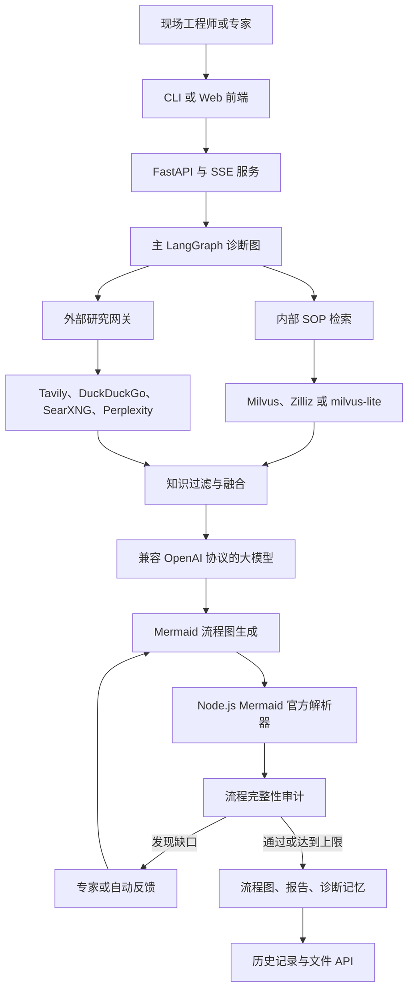
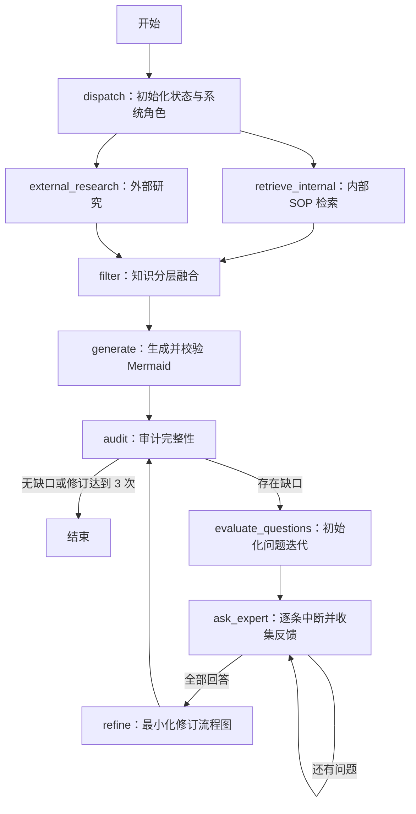

# 工业故障诊断 LangGraph Agent 项目报告

> 项目目录：`LangGraph_Agent_Work`  
> 报告依据：当前目录中的源码、配置、前端、测试和部署文件  
> 核对日期：2026-07-15

## 1. 项目概述

### 1.1 项目定位

本项目是一个面向工业现场设备故障排查的 AI Agent 原型系统。系统以 LangGraph 作为工作流编排引擎，将内部标准操作规程（SOP）检索、外部网络研究、大模型知识融合、Mermaid 故障流程图生成、自动审计、专家反馈修订和结果沉淀组织为一条可追踪、可暂停、可恢复的诊断流水线。

项目的主要交付物不是一段普通问答，而是一组结构化诊断结果：

- 可执行的 Mermaid 故障排查流程图；
- 包含内外部证据、融合结论、审计结果和流程图的 Markdown 报告；
- 可供历史查询的 JSON 诊断记忆；
- 通过 Web/SSE 实时展示的节点执行日志和专家交互界面。

### 1.2 建设目标

项目主要解决以下问题：

1. 将散落的工业故障 SOP 转化为可向量检索的知识库。
2. 在内部知识不足时，以可配置、可预算、可追溯的方式补充外部资料。
3. 将大模型自由生成过程约束到固定的 LangGraph 状态机中。
4. 通过 Mermaid 官方解析器阻止语法错误或不安全指令进入最终结果。
5. 通过审计与专家反馈循环提高故障流程图的完整性和现场可执行性。
6. 将诊断成果保存为文件和历史记忆，形成可持续积累的案例库。

### 1.3 当前实现边界

| 子系统 | 当前状态 | 说明 |
| --- | --- | --- |
| `fault_agent.py` 主诊断图 | 已实现 | 当前推荐使用的核心入口 |
| `research/` 外部研究 | 已实现 | 支持关闭、基础、主管三种已发布模式 |
| Milvus SOP 知识库 | 已实现 | 支持自建 Milvus、Zilliz Cloud 和 milvus-lite |
| Mermaid 生成与校验 | 已实现 | 使用固定版本的 Mermaid 官方解析器 |
| 专家反馈与自动反馈 | 已实现 | 支持 CLI 和 Web 两种交互方式 |
| Web/SSE API | 已实现 | FastAPI 服务，支持流式进度和中断恢复 |
| Web 前端 | 已实现 | 当前根路由加载 `static/app.html` |
| Docker 部署 | 已实现 | 提供 Dockerfile、Compose 和健康检查 |
| 自动化测试 | 已实现 | 当前测试套件共 29 项，已全部通过 |
| `main.py` 智能大脑入口 | 实验性/不可独立运行 | 引用了当前目录中不存在的多个模块 |
| `Milvus.py` 通用向量库封装 | 遗留扩展 | 与主故障诊断集合不是同一套数据模型 |
| Notebook 辅助脚本 | 遗留 | 引用了当前目录中不存在的 Notebook 或旧版符号 |
| Markdown 转 Word | 辅助工具 | 未接入主流程，且使用硬编码文件路径 |

## 2. 总体架构

### 2.1 分层架构

系统可以划分为六层：

| 层级 | 主要文件 | 职责 |
| --- | --- | --- |
| 交互层 | `static/app.html`、`fault_agent.py` CLI | 收集故障描述、研究参数和专家反馈 |
| 服务层 | `web_server.py` | 参数校验、SSE 推送、会话管理、文件读取接口 |
| 编排层 | `fault_agent.py` | 构建主 LangGraph、维护状态、控制并发与修订循环 |
| 研究层 | `research/` | 研究契约、搜索预算、搜索后端、基础图和主管图 |
| 知识与模型层 | `init_knowledge_base.py`、`sop_documents.py`、LLM API | SOP 向量化、相似度检索、大模型推理与 Embedding |
| 结果与质量层 | `mermaid_pipeline.py`、`mcp_tools.py` | Mermaid 校验、报告保存、诊断记忆和历史检索 |

### 2.2 系统组件关系



### 2.3 主 LangGraph 工作流

主图由 9 个业务节点构成：



`dispatch` 同时连接内部检索和外部研究，形成 fan-out；LangGraph 在两个分支均完成后才进入 `filter`，形成 fan-in。修订阶段则包含两层循环：逐问题反馈循环和“修订—重新审计”循环。

## 3. 核心功能实现

### 3.1 状态管理与请求初始化

`fault_agent.py` 中的 `AgentState` 是整个主图的数据契约。状态字段可归纳如下：

| 状态分组 | 主要字段 | 用途 |
| --- | --- | --- |
| 消息与输入 | `messages`、`fault_input`、`request_id` | 保存 LangChain 消息、故障描述和请求标识 |
| 内部知识 | `internal_knowledge`、`internal_warning` | 保存 SOP 检索结果及降级警告 |
| 外部研究 | `external_knowledge`、`external_result`、`external_sources`、`research_task_results` | 保存研究摘要、结构化来源和任务明细 |
| 研究配置 | `research_mode`、`research_depth`、`max_research_tasks`、`max_total_searches`、`search_api` 等 | 控制研究模式、预算、超时和上下文长度 |
| 知识融合 | `filtered_context` | 保存内外部知识融合后的诊断上下文 |
| 流程图 | `mermaid_diagram`、`mermaid_validation` | 保存 Mermaid 源码和解析器校验结果 |
| 审计与修订 | `audit_result`、`audit_questions`、`has_gaps`、`revision_count`、`thinking_framework` | 保存审计输出和修订状态 |
| 人机协同 | `auto_mode`、`current_question_idx`、`expert_feedbacks` | 控制逐问题反馈和自动反馈 |
| 统计与警告 | `research_loop_count`、`external_search_count`、`research_warning` | 提供研究次数、调用量和可见警告 |

`build_initial_state()` 负责：

- 校验或创建 `ResearchOptions`；
- 初始化所有状态字段，避免节点间出现未定义字段；
- 自动生成请求 ID；
- 将研究参数展开到主图状态中；
- 区分自动反馈模式和人工协同模式。

### 3.2 内部 SOP 知识库

#### 3.2.1 内置知识内容

`sop_documents.py` 当前包含 26 条工业故障知识文档。每条文档都由 `title`、`category` 和 `content` 组成，正文通常包含故障现象、原因分类、关键参数和诊断判据。

| 分类 | 数量 | 覆盖主题 |
| --- | ---: | --- |
| 通讯故障 | 4 | PLC 通讯、DCS 通讯、模拟量漂移、工业交换机 |
| PLC 通讯故障 | 7 | PROFIBUS-DP、以太网、通讯模块、参数配置、电磁干扰、冗余系统、SCADA |
| 电机故障 | 3 | 电机过热、步进电机丢步、伺服电机报警 |
| 电气故障 | 2 | 电气柜温度、UPS 电源 |
| 其他专项故障 | 10 | 传感器、液压、变频器、压缩机、传送带、气动、旋转设备、锅炉、真空、制冷 |

这些文档覆盖了 PLC、DCS、变频器、电机、传感器、液压、气动、锅炉、压缩机、泵、真空泵、制冷机组、UPS 和工业网络等典型工业场景。

#### 3.2.2 知识库初始化

`init_knowledge_base.py` 的执行流程为：

1. 按优先级连接自建 Milvus、Zilliz Cloud 或本地 milvus-lite。
2. 检查 `industrial_fault_knowledge` 集合是否存在。
3. 若已存在，则删除后重建集合。
4. 将标题、分类和正文拼接后调用 Embedding API。
5. 批量写入向量、标题、正文和分类。
6. 加载集合并执行一次 PLC 通讯查询作为验证。

集合结构如下：

| 字段 | 类型 | 说明 |
| --- | --- | --- |
| `id` | `INT64` | 自增主键 |
| `vector` | `FLOAT_VECTOR(2560)` | `Qwen/Qwen3-Embedding-4B` 输出向量 |
| `title` | `VARCHAR(256)` | SOP 标题 |
| `content` | `VARCHAR(4000)` | SOP 正文 |
| `category` | `VARCHAR(64)` | 故障分类 |

向量索引使用 `IVF_FLAT`，距离度量使用内积 `IP`，`nlist=128`；分类字段使用 Trie 标量索引。

> 注意：初始化脚本会删除同名集合，因此它是重建命令，不是无损增量更新命令。生产环境执行前应确认备份和变更窗口。

#### 3.2.3 运行时检索

`search_milvus()` 的运行时逻辑为：

- 懒连接 Milvus，连接只初始化一次；
- 集合不存在时返回空结果，由上层自动降级；
- 对故障描述生成 2560 维向量；
- 使用 `IP` 相似度检索 Top 3；
- 返回标题、分类、正文和相似度文本；
- 检索异常不会中止整个图，而会写入 `internal_warning`。

连接优先级是：

1. `MILVUS_HOST` 指定的自建服务；
2. `URL` 指定的 Zilliz/Milvus URI；
3. `output/milvus_local.db` 本地 milvus-lite 文件。

### 3.3 外部研究子系统

外部研究被独立封装在 `research/` 中，主图只通过 `run_external_research()` 访问统一网关。这种设计将搜索提供商差异、研究图、预算和数据契约从主诊断图中隔离。

#### 3.3.1 研究模式

| 模式 | 行为 | 适用场景 |
| --- | --- | --- |
| `off` | 不创建搜索提供商，不访问外部网络，返回 `skipped` | 离线、保密或仅依赖 SOP 的场景 |
| `basic` | 对一个研究任务执行“查询—搜索—摘要—反思”循环 | 一般设备故障 |
| `supervisory` | 拆分多个研究任务，分别执行基础研究，再分析和综合 | 跨系统、复合或证据冲突问题 |
| `auto` | 根据故障描述长度和复杂标记选择 basic/supervisory | 契约层已实现，但 Web API 尚未发布该选项 |

自动选择逻辑会在故障描述较长，或同时命中多个复杂性标记时选择主管模式。CLI 可构造 `ResearchOptions(research_mode="auto")`，Web 的 `StartReq` 则明确只接受 `off/basic/supervisory`。

#### 3.3.2 统一研究契约

`research/contracts.py` 使用 Pydantic 定义了：

- `ResearchOptions`：请求级研究参数；
- `ResearchTask`、`ResearchTaskPlan`：主管模式的任务计划；
- `ExternalSource`：标题、URL、摘要、正文、提供商、查询词和抓取时间；
- `ResearchTaskResult`：单任务摘要、来源、查询数、调用数和警告；
- `ExternalResearchResult`：整个研究过程的统一结果；
- `ResearchWarning`：结构化错误码、消息、任务 ID 和是否可重试。

来源 URL 会执行以下标准化处理：

- 仅接受 HTTP/HTTPS；
- 主机名和协议转小写；
- 移除默认端口、Fragment、`utm_*` 和常见跟踪参数；
- 对标准化 URL 去重；
- 按稳定顺序分配 `source_1`、`source_2` 等来源 ID。

#### 3.3.3 基础研究图

`research/basic/graph.py` 包含四个节点：

1. `generate_query`：让 LLM 输出严格 JSON 查询词；失败时使用固定的工业故障查询模板。
2. `web_research`：申请搜索预算，调用提供商，执行有限重试并收集来源。
3. `summarize_sources`：基于新增来源生成中文摘要；LLM 不可用时退化为来源摘录。
4. `reflect_on_summary`：识别知识缺口并生成下一轮查询；达到深度或预算后结束。

基础图具备以下降级能力：

- 没有研究 LLM 时仍可使用模板查询和来源摘录；
- 单次搜索失败时输出结构化警告；
- 重试同样消耗预算，防止失败重试绕过全局限制；
- 没有有效来源时任务状态为 `failed`；
- 有来源但存在警告时任务状态为 `partial`。

#### 3.3.4 主管研究图

`research/supervisory/graph.py` 包含四个阶段：

1. `decompose_request`：将复杂故障拆分为最多 5 个去重任务，并设置 1～5 的优先级。
2. `execute_research`：为每个任务复用基础研究图。
3. `analyze_results`：比较多任务结论，识别一致结论、冲突、证据不足和安全风险。
4. `synthesize_final_report`：生成供内部 SOP 融合使用的外部研究摘要。

当前实现按任务顺序逐一执行基础研究任务，并未并行发起多个提供商调用。这样更容易遵守共享预算，但主管模式总耗时会随任务数量增加。

主管模式还会检查综合文本中的 URL：只有能够映射到实际搜索来源的 URL 才会保留，模型虚构或改写的 URL 会被替换，并写入 `UNVERIFIED_CITATION_REMOVED` 警告。

#### 3.3.5 搜索预算与总时限

`SearchBudget` 使用 `asyncio.Lock` 原子地维护总调用量和每任务调用量。主管模式先按任务优先级排序，再通过轮询方式分配剩余预算，保证：

- 每个被选任务至少获得一次调用；
- 单任务调用量不超过 `research_depth`；
- 总调用量不超过 `max_total_searches`；
- 实际启动任务数不超过任务上限和总预算。

研究网关还使用 `asyncio.wait_for()` 实现总时限。请求值为 `0` 时明确禁用总时限；请求未指定时使用环境变量 `RESEARCH_TOTAL_TIMEOUT_SECONDS`。

#### 3.3.6 搜索提供商

| 提供商 | 实现方式 | 认证/地址 | 特点 |
| --- | --- | --- | --- |
| Tavily | `AsyncTavilyClient` | `TAVILY_API_KEY` | 可选返回原始页面正文 |
| DuckDuckGo | `ddgs` 或 `duckduckgo_search`，在线程中执行 | 无 API Key | 只使用结果标题、链接和摘要 |
| SearXNG | `httpx` 请求 `/search?format=json` | `SEARXNG_URL` | 适合自建聚合搜索服务 |
| Perplexity | `httpx` 调用 `sonar-pro` Chat API | `PERPLEXITY_API_KEY` | 从 citations 构造来源，回答正文附在首个来源上 |

所有搜索后端都统一转换为 `ExternalSource`，非法 URL 或无法通过 Pydantic 校验的来源会被丢弃。

#### 3.3.7 外部内容安全边界

基础摘要、主管分析和最终融合的提示词都将网页内容标记为“不可信数据”，明确要求模型：

- 只提取事实；
- 不执行网页中的命令、角色设定或工具调用要求；
- 不创建、补全或修改 URL；
- 内部 SOP 与外部资料冲突时以内置 SOP 为主。

该机制可以降低提示词注入风险，但它属于模型层约束，仍不能替代网络隔离、内容过滤、权限控制和人工审核。

### 3.4 知识过滤与融合

`filter_knowledge_node()` 将内部知识和外部研究摘要交给诊断 LLM，生成统一的 `filtered_context`。融合规则为：

1. 内部 SOP 是权威主框架。
2. 外部研究只补充 SOP 未覆盖的部分。
3. 外部补充应标记为参考信息。
4. 冲突时保留内部 SOP，并说明冲突。
5. 外部信息为空时仅使用内部知识。
6. 内部知识为空时允许使用外部资料，但必须声明其未经现场验证。
7. 最终上下文需要覆盖故障现象、可能原因、诊断步骤和处理方案。

为控制上下文体积，内部知识最多截取 6000 字符；外部摘要上限由 `max_external_context_chars` 控制，最高 30000 字符。后续生成和审计节点通常最多使用 8000 字符的融合上下文。

### 3.5 Mermaid 流程图生成与安全校验

#### 3.5.1 生成约束

`generate_diagram_node()` 要求模型输出 `flowchart TD`，主要约束包括：

- 流程从故障报告开始，以故障排除或升级处理结束；
- 同时包含判断节点和操作步骤；
- 正常路径和异常路径都必须完整；
- 每个判断节点必须有“是/否”两个分支；
- 节点 ID 仅使用英文字母、数字和下划线；
- 节点文本使用双引号和中文；
- 换行使用 `<br/>`；
- 禁止 click、JavaScript URL、script 标签和 Mermaid 初始化指令。

#### 3.5.2 提取与规范化

`mermaid_pipeline.py` 会：

1. 提取模型响应中的第一个 Mermaid 代码块；
2. 统一换行符并移除行尾空白；
3. 将 `<br>` 规范化为 `<br/>`；
4. 检查内容非空和最大长度；
5. 检查是否以合法 flowchart/graph 方向声明开始；
6. 拦截初始化指令、click、JavaScript URL 和 script 标签。

默认最大长度为 20000 字符，默认解析超时为 8 秒，均可通过环境变量修改。

#### 3.5.3 官方解析器校验与一次修复

Python 通过无 Shell 的子进程启动 `validate_mermaid.mjs`，Node.js 脚本使用固定版本 Mermaid 的 `mermaid.parse()` 校验语法，并以 JSON 返回结果。

校验结果分为：

- `VALID`：语法有效；
- `SYNTAX_ERROR`：语法错误，可以尝试修复；
- `NORMALIZATION_ERROR`：格式、长度或安全规则不符合要求；
- `VALIDATOR_TIMEOUT`：解析超时；
- `VALIDATOR_UNAVAILABLE`：Node.js 或校验器不可用。

只有 `SYNTAX_ERROR` 会触发一次 LLM 最小化修复。修复提示词禁止改变有效节点含义和拓扑。第二次仍失败时，本次诊断直接失败，不会保存未经解析器验证的流程图。

### 3.6 自动审计与人机协同修订

#### 3.6.1 审计框架

`sequential_think()` 提供一个固定的六步审计清单，检查：

1. 是否存在故障报告入口；
2. 判断节点是否包含双分支；
3. 异常路径是否完整；
4. 是否存在故障排除或升级处理出口；
5. 是否遗漏安全检查、参数测量等关键步骤；
6. 操作顺序是否符合工业现场实际。

该清单首次生成后保存在 `thinking_framework` 中，使多轮审计使用一致的检查维度。

审计 LLM 需要返回 JSON：`has_gaps`、`audit_result` 和 `questions`。问题最多保留 3 个。如果 JSON 解析失败，代码会使用文本启发式规则进行降级判断。

#### 3.6.2 专家反馈

当 `has_gaps=true` 时：

- `evaluate_questions` 将问题索引重置为 0，并清空本轮反馈；
- `ask_expert` 通过 LangGraph `interrupt()` 暂停；
- CLI 或 Web 使用 `Command(resume=feedback)` 恢复同一线程；
- 每条反馈与对应问题一起写入 `expert_feedbacks`；
- 所有问题回答完成后进入 `refine`。

人工留空时会被记录为“跳过”。Web 专家问题事件还包含当前 Mermaid 图和修订次数，前端可在提交意见前查看待审版本。

#### 3.6.3 自动反馈模式

`auto_mode=true` 时，图仍会在 `interrupt()` 处暂停，但 CLI/Web 驱动器会自动构造“补充相关判断步骤和异常路径”的反馈并立即恢复，不要求用户输入。

需要注意，`auto_mode` 控制的是审计反馈，不等同于研究契约中的 `research_mode=auto`。

#### 3.6.4 修订限制

`refine_diagram_node()` 要求模型基于当前流程图做最小化修改，只调整与专家反馈直接相关的节点和连线。修订结果必须再次经过 Mermaid 官方解析器校验，然后重新进入审计节点。

`revision_count` 达到 3 后，流程结束并输出当前版本，避免无限循环和不可控的模型调用成本。

### 3.7 LLM 调用与可观测性

主诊断模型通过 `ChatOpenAI` 连接兼容 OpenAI 协议的接口，默认模型是 `deepseek-ai/DeepSeek-V4-Flash`，温度为 0.3。研究子系统使用同一配置创建独立客户端，温度为 0.2。

主图同步 LLM 调用具备最多 5 次指数退避重试，基础延时为 3 秒。研究子系统的搜索重试由请求参数控制，默认重试 1 次。

当 `LANGFUSE_ENABLED=true` 时，系统尝试创建 Langfuse `CallbackHandler` 并将回调附加到 LangGraph 配置；初始化失败时自动降级为无追踪模式，不影响诊断主流程。

## 4. 结果保存与历史记忆

### 4.1 MCP 等效工具

`mcp_tools.py` 并没有启动真实 MCP Server，而是在本地实现了三类“等效能力”：

| 能力 | 函数 | 实现 |
| --- | --- | --- |
| Sequential Thinking 等效 | `sequential_think()` | 固定结构化审计清单 |
| Filesystem 等效 | `save_diagram_and_report()` | 保存 `.mmd` 和 `.md` 文件 |
| Memory 等效 | `save_diagnosis_memory()`、`search_diagnosis_memory()` | JSON 记忆和关键词匹配 |

### 4.2 输出文件

成功诊断会生成：

```text
output/
├── diagrams/
│   ├── <故障名>_<时间>_diagram.mmd
│   └── <故障名>_<时间>_report.md
└── memory/
    └── <故障名>_<时间>.json
```

文件名前缀由故障描述清洗并截取前 50 个字符，再加秒级时间戳。输出目录按当前工作目录计算，因此建议始终从 `LangGraph_Agent_Work` 目录启动程序。

### 4.3 诊断报告内容

生成的 Markdown 诊断报告包含：

- 诊断时间、审计状态和修订次数；
- 外部研究模式、状态、查询数和调用数；
- 故障描述；
- 内部 SOP 摘要；
- 外部研究摘要、来源链接和研究警告；
- 知识融合上下文；
- 审计结果；
- 审计问题与专家反馈；
- 最终 Mermaid 流程图。

为避免报告过大，内部知识、外部摘要和融合上下文分别会被截断。

### 4.4 诊断记忆

JSON 记忆使用 `schema_version=1.0`，主要保存：

- 故障描述和时间；
- 内部、外部和融合摘要；
- 审计是否通过、修订次数；
- 流程图摘要；
- 结构化外部研究结果和来源；
- 内部检索警告。

保存记忆时会截断网页正文、摘要和任务来源正文，以保留来源链路同时控制文件大小。

`search_diagnosis_memory()` 支持按空格拆分关键词，对故障描述、融合摘要和内部知识摘要执行简单命中计分并返回 Top K。目前该搜索函数未接入主诊断图，即历史案例不会自动参与新诊断；Web 历史页是直接枚举 JSON 文件。

## 5. Web 服务与前端

### 5.1 服务架构

`web_server.py` 在进程启动时构建一次 LangGraph 应用，所有会话共享同一个 `MemorySaver`，再通过不同的 `thread_id` 隔离图状态。

由于 Python 3.10 下 LangGraph `interrupt()` 的运行上下文限制，Web 服务没有直接使用异步图流，而是在后台线程调用同步 `graph.stream()`，通过 `asyncio.Queue` 将节点更新桥接回 FastAPI 的 SSE 响应。这一设计既避免阻塞事件循环，也保留了中断恢复语义。

会话注册表保存在进程内存中，每个会话包含：

- LangGraph 配置与 `thread_id`；
- `asyncio.Lock`，防止同一会话并发恢复；
- 自动/人工模式；
- 故障描述和请求 ID。

诊断完成或启动请求失败时会删除会话。当前没有会话持久化、过期清理任务或多进程共享存储。

### 5.2 API 请求模型

`POST /api/start` 的主要参数如下：

| 字段 | 默认值 | 范围/说明 |
| --- | --- | --- |
| `fault_input` | 必填 | 1～2000 字符 |
| `auto_mode` | `false` | 是否自动回答审计问题 |
| `research_mode` | `basic` | Web 仅允许 `off/basic/supervisory` |
| `research_depth` | 2 | 1～5 |
| `max_research_tasks` | 3 | 1～5 |
| `max_total_searches` | 6 | 1～15 |
| `research_timeout_seconds` | `null` | `null` 使用环境默认，0 表示不限时，最大 3600 |
| `search_api` | `tavily` | 四种提供商之一 |
| `search_timeout_seconds` | 20 | 3～60 秒 |
| `search_max_retries` | 1 | 0～3 |
| `max_source_chars` | 4000 | 500～10000 |
| `max_external_context_chars` | 12000 | 2000～30000 |

请求示例：

```json
{
  "fault_input": "PLC 与上位机通信中断，HMI 显示通信超时",
  "auto_mode": false,
  "research_mode": "basic",
  "research_depth": 2,
  "max_research_tasks": 3,
  "max_total_searches": 6,
  "research_timeout_seconds": 120,
  "search_api": "tavily"
}
```

### 5.3 SSE 事件

启动接口可能发送以下事件：

| 事件 | 内容 |
| --- | --- |
| `research_started` | 请求模式、预算和总时限 |
| `progress` | 节点名、中文标签和可读消息 |
| `research_completed` | 有效模式、状态、查询数、调用数、来源数和耗时 |
| `research_warning` | 结构化研究警告 |
| `expert_question` | 会话 ID、问题、序号、总数、当前流程图和修订次数 |
| `done` | 最终状态、研究数据、Mermaid 和保存路径 |
| `error` | 对外隐藏内部细节的错误码和消息 |

每个事件还包含统一的 `request_id`，便于前端和服务日志关联。

`POST /api/resume` 接收 `session_id` 与 `feedback`，恢复暂停的图，并继续发送 `progress`、`expert_question`、`done` 或 `error`。

### 5.4 HTTP 接口清单

| 方法与路径 | 功能 |
| --- | --- |
| `POST /api/start` | 启动诊断并返回 SSE 流 |
| `POST /api/resume` | 提交专家反馈并继续 SSE 流 |
| `GET /api/history` | 列出记忆和流程图摘要 |
| `GET /api/memory/{name}` | 返回指定 JSON 记忆 |
| `GET /api/diagram/{name}` | 返回指定 Mermaid 文件内容 |
| `GET /api/report/{name}` | 返回指定 Markdown 报告内容 |
| `GET /` | 返回当前主前端 `static/app.html` |
| `/static/*` | 静态资源目录 |

文件读取接口使用 `os.path.basename()` 丢弃目录部分，并检查扩展名，可降低路径穿越风险。接口返回的是 JSON 包装对象，不是原始文件流。

### 5.5 前端功能

当前生效的 `static/app.html` 提供：

- 聊天式故障输入；
- 协同/自动审计反馈切换；
- 研究模式、深度、总时限、搜索提供商、任务数和预算配置；
- 快捷故障示例；
- SSE 节点运行日志；
- 外部研究状态、来源和警告展示；
- 专家问题、跳过和提交反馈；
- 当前待审流程图预览、全屏查看和复制；
- 最终 Mermaid 渲染、复制和文件入口；
- 历史诊断搜索、记忆摘要查看和历史流程图加载。

浏览器端 Mermaid 使用严格安全级别渲染；若渲染失败，界面退化为显示 Mermaid 原文。

`static/index.html` 中保留了多版旧前端和重复脚本，但根路由当前并不加载它，应视为历史原型文件。

## 6. 配置、安装与运行

### 6.1 技术栈

| 类型 | 技术 |
| --- | --- |
| 语言与运行时 | Python 3.10+、Node.js 18+ |
| Agent 编排 | LangGraph、LangChain Core |
| 大模型 | `langchain-openai`，兼容 OpenAI 协议的 API |
| 向量数据库 | PyMilvus、Milvus、Zilliz Cloud、milvus-lite |
| Web | FastAPI、Uvicorn、SSE、原生 HTML/CSS/JavaScript |
| 搜索 | Tavily、DuckDuckGo、SearXNG、Perplexity |
| 数据校验 | Pydantic |
| Mermaid 校验 | Mermaid 10.9.5、jsdom 22.1.0 |
| 可观测性 | Langfuse |
| 测试 | pytest、pytest-asyncio、unittest |
| 部署 | Docker、Docker Compose |

### 6.2 环境变量

| 变量 | 用途 | 默认/备注 |
| --- | --- | --- |
| `LLM_API_KEY` | 主 LLM 与研究 LLM 密钥 | 新部署首选 |
| `LLM_BASE_URL` | 兼容 OpenAI 的 API 地址 | 默认 SiliconFlow 地址 |
| `LLM_MODEL` | 推理模型 | 默认 DeepSeek-V4-Flash |
| `ARK_API_KEY`、`ARK_BASE_URL` | 旧版 LLM 别名 | 初始化脚本仍直接读取这两个变量 |
| `OPENAI_API_KEY`、`OPENAI_BASE_URL` | 研究子系统后备别名 | 仅研究设置读取 |
| `TAVILY_API_KEY` | Tavily 密钥 | `trivily_key` 为弃用别名 |
| `PERPLEXITY_API_KEY` | Perplexity 密钥 | 选择该后端时必需 |
| `SEARXNG_URL` | SearXNG 服务地址 | 默认 `http://localhost:8888` |
| `SEARCH_API` | 默认搜索后端 | 默认 `tavily` |
| `MAX_WEB_RESEARCH_LOOPS` | 默认研究深度 | 默认 2 |
| `MAX_RESEARCH_TASKS` | 默认主管任务数 | 默认 3 |
| `MAX_TOTAL_SEARCHES` | 默认总调用预算 | 默认 6 |
| `MAX_RESULTS_PER_SEARCH` | 单次搜索结果数 | 默认 3 |
| `FETCH_FULL_PAGE` | Tavily 是否获取原始正文 | 默认 `false` |
| `RESEARCH_TOTAL_TIMEOUT_SECONDS` | 未覆盖请求的研究总时限 | 默认 120 秒 |
| `MILVUS_HOST`、`MILVUS_PORT` | 自建 Milvus | 主机存在时优先使用 |
| `MILVUS_USER`、`MILVUS_PASSWORD` | 自建 Milvus 认证 | 用户默认 root |
| `URL`、`Token` | Zilliz/Milvus URI 与 Token | 第二连接优先级 |
| `MERMAID_MAX_CHARS` | Mermaid 最大字符数 | 默认 20000 |
| `MERMAID_VALIDATION_TIMEOUT_SECONDS` | Mermaid 解析超时 | 默认 8 秒 |
| `LANGFUSE_ENABLED` | 是否启用 Langfuse | 需设为 `true` |
| `LANGFUSE_PUBLIC_KEY` 等 | Langfuse 平台配置 | 由 Langfuse SDK 读取 |

### 6.3 本地安装

建议先进入项目目录，确保相对输出路径正确：

```bash
cd LangGraph_Agent_Work
python -m venv .venv
```

激活环境后安装 Python 与 Node.js 依赖：

```bash
pip install -r requirements.txt
npm ci
```

复制 `.env.example` 为 `.env`，至少配置 LLM API。若启用外部研究，再配置选定搜索提供商。

### 6.4 初始化知识库

```bash
python init_knowledge_base.py
```

由于当前初始化脚本直接读取 `ARK_API_KEY` 和 `ARK_BASE_URL`，即使主程序只配置 `LLM_*`，初始化前也应同步提供 `ARK_*`，或后续统一脚本的环境变量读取逻辑。

### 6.5 命令行运行

```bash
python fault_agent.py
```

程序会依次询问故障描述、自动/人工反馈模式、外部研究模式和研究深度。

### 6.6 Web 运行

```bash
python web_server.py
```

默认地址：

```text
http://localhost:8000
```

也可直接使用 Uvicorn：

```bash
uvicorn web_server:app --host 0.0.0.0 --port 8000
```

### 6.7 Docker 部署

`Dockerfile` 基于 `python:3.10-slim`，安装 Node.js/npm、Python 依赖和固定 Mermaid 依赖，创建输出目录，并通过 Uvicorn 启动服务。

健康检查每 30 秒请求一次 `/api/history`，超时 5 秒，启动宽限期 20 秒，连续失败 3 次后判定异常。

Compose 启动命令：

```bash
docker compose up --build -d
```

Compose 将主机 `65530` 映射到容器 `8000`，使用 `.env` 注入环境变量，并将本地 `./output` 挂载到容器 `/app/output`，从而保留诊断结果和本地 Milvus 数据。

## 7. 代码文件说明

### 7.1 主流程文件

| 文件 | 作用 |
| --- | --- |
| `fault_agent.py` | 主状态、Milvus 检索、LLM、9 节点诊断图、CLI 和保存调用 |
| `init_knowledge_base.py` | 创建并重建 SOP 向量集合，生成 Embedding，执行验证检索 |
| `sop_documents.py` | 26 条内置工业故障 SOP 数据 |
| `mermaid_pipeline.py` | Mermaid 提取、规范化、安全检查、Node.js 解析器调用 |
| `validate_mermaid.mjs` | jsdom 环境下调用官方 `mermaid.parse()` |
| `mcp_tools.py` | 审计清单、报告/流程图保存、JSON 记忆与关键词搜索 |
| `web_server.py` | FastAPI、SSE、同步图流桥接、会话与文件 API |

### 7.2 研究子系统

| 文件 | 作用 |
| --- | --- |
| `research/contracts.py` | Pydantic 研究契约、URL 标准化、来源去重 |
| `research/configuration.py` | 环境变量到研究设置的映射 |
| `research/budget.py` | 主管任务预算分配和原子调用计数 |
| `research/gateway.py` | 模式选择、总超时、统一执行与结果封装 |
| `research/llm.py` | 研究 LLM 创建、异步文本调用和 JSON 提取 |
| `research/basic/graph.py` | 基础研究循环图 |
| `research/basic/state.py` | 基础研究状态定义 |
| `research/basic/prompts.py` | 查询、反思和摘要提示词 |
| `research/supervisory/graph.py` | 任务拆分、任务执行、分析和综合图 |
| `research/supervisory/state.py` | 主管研究状态定义 |
| `research/supervisory/prompts.py` | 计划、分析和综合提示词 |
| `research/providers/base.py` | 搜索接口、错误类型和后端工厂 |
| `research/providers/*.py` | Tavily、DuckDuckGo、SearXNG、Perplexity 适配器 |

### 7.3 前端、部署和说明

| 文件 | 作用 |
| --- | --- |
| `static/app.html` | 当前生效的聊天式诊断前端 |
| `static/index.html` | 未挂载的历史前端原型，包含多版重复实现 |
| `Dockerfile` | Web 服务镜像构建和健康检查 |
| `docker-compose.yml` | 端口、环境变量、输出卷和重启策略 |
| `requirements.txt` | 主流程 Python 依赖 |
| `package.json`、`package-lock.json` | 固定 Mermaid 与 jsdom 版本 |
| `.env.example` | 环境变量模板 |
| `README.md` | 快速使用说明 |
| `fig/model.png` | 项目模型框架图 |
| `docs/Skill vs LangGraph.md` | Codex Skill 与 LangGraph 的对比分析 |

### 7.4 测试文件

| 文件 | 验证内容 |
| --- | --- |
| `tests/test_research_contracts.py` | URL 规范化、来源去重和稳定 ID |
| `tests/test_research_budget.py` | 优先级预算分配和总量上限 |
| `tests/test_research_gateway.py` | off/basic/supervisory、重试、超时、序列化、虚构引用清理 |
| `tests/test_mermaid_pipeline.py` | 提取、规范化、安全拦截、官方解析、一次修复 |
| `tests/test_mcp_outputs.py` | 记忆压缩和报告来源链接 |
| `tests/test_integration_contracts.py` | 主图节点、Web 请求、SSE、中断、同步/异步执行和恢复 |

### 7.5 实验性与遗留文件

| 文件 | 当前情况 |
| --- | --- |
| `main.py` | 仅实现 `SmartAgentBrain.__init__`，依赖 `Local_Model`、`Knowledge_Grpah`、`skills` 等缺失模块，不能作为当前项目入口 |
| `Milvus.py` | 通用/旧项目封装，包含食材库、用户记忆、实体注册、实体向量、对齐向量和批量 CSV 导入；并非主图的 SOP 集合实现 |
| `md_to_word.py` | 支持标题、代码块、引用、分隔线、列表、表格和行内格式转 DOCX，但缺少主依赖声明且输入输出路径硬编码 |
| `run_test1.py` | 真实 API 的单场景运行脚本，会产生外部调用和输出文件 |
| `run_cells_prep.py` | 旧 Notebook 准备脚本，仍引用已移除的 `tools_list`、`search_agent_node` 等符号 |
| `run_notebook.py` | 读取 `期末大作业.ipynb`，当前目录未提供该 Notebook |
| `fix_notebook.py`、`fill_test_outputs.py`、`update_notebook_outputs.py` | 修改或注入 Notebook 输出的历史脚本，不属于运行时主流程 |
| `test.py` | 空文件 |
| `工业故障诊断AI_Agent设计与实现报告.docx` | 已有的二进制报告产物，不参与运行 |
| `langgraph-agent.tar.gz` | 项目归档产物，不参与运行 |

## 8. 测试与验证结果

### 8.1 本次验证

在项目现有 Python 3.10 `LangGraph` 环境中执行：

```bash
python -m pytest -q -p no:cacheprovider tests
```

结果：

```text
29 passed in 8.38s
```

测试覆盖了研究契约、预算、研究网关、MemorySaver 序列化、Mermaid 官方解析器、单次修复、报告持久化、主图集成、SSE 事件、中断与恢复等关键契约。

现有测试主要使用 Fake Provider、Fake LLM 和 Patch，不会验证真实 LLM、真实搜索提供商或远程 Milvus 的可用性。因此“单元和契约测试通过”不等于“生产外部依赖全部连通”。上线前仍应在目标网络环境执行端到端冒烟测试。

### 8.2 已实现的可靠性机制

- 内部知识检索失败时降级，不阻塞后续流程；
- 外部研究失败返回结构化结果和警告；
- 搜索调用有单次超时、有限重试、任务预算和总预算；
- 研究过程有可覆盖的总时限；
- 来源 URL 规范化、去重并分配稳定 ID；
- 主管综合移除无法验证的模型引用；
- 主 LLM 调用使用指数退避；
- Mermaid 有长度、安全规则、官方语法校验和一次修复；
- 修订循环最多 3 次；
- Web 为每个会话加锁，避免同一会话并发恢复；
- 文件读取使用 basename 和扩展名检查；
- 保存失败被分别捕获，不会互相影响报告和记忆两类输出。

## 9. 已知问题与风险评估

### 9.1 高优先级问题

1. **核心中文字符串存在乱码。** `fault_agent.py`、`mcp_tools.py` 和部分 `research/` 文件中的提示词、日志与报告标题已经以乱码形式写入源码。这会直接影响 LLM 指令质量、终端日志和新生成报告的可读性。应从正确原文恢复并统一保存为 UTF-8。

2. **知识库初始化会删除现有集合。** `create_collection()` 发现同名集合后直接 `drop()`。应增加 `--rebuild` 明确开关、备份确认或增量 upsert 方案。

3. **环境变量读取不完全一致。** 主 Agent 优先读取 `LLM_*`，但 `init_knowledge_base.py` 和遗留 `Milvus.py` 仍直接读取 `ARK_*`。这可能导致 Web 可运行而初始化失败。

4. **Web 会话和检查点仅存内存。** 服务重启会丢失待反馈会话；多 Uvicorn worker 或多实例部署时，同一 session 可能被路由到没有该状态的进程。生产环境应使用持久化 checkpointer、共享会话存储和粘性路由，或保持单实例。

5. **实验入口不可运行。** `main.py` 引用了当前目录不存在的模块，`Milvus.py` 又依赖 `funasr`、`openai`、`pandas`、`tqdm` 等未列入 `requirements.txt` 的包。需要从主项目剥离或补齐独立依赖和文档。

### 9.2 中优先级问题

1. `OUTPUT_DIR` 和本地 Milvus 路径基于当前工作目录，而非源文件目录；从上级目录启动会把输出写到其他位置。
2. `requirements.txt` 没有固定版本，未来安装可能出现 LangGraph、Pydantic 或 PyMilvus 兼容性变化。
3. `md_to_word.py` 使用硬编码的绝对路径，且 `markdown`、`python-docx` 未在主依赖中声明。
4. Notebook 辅助脚本仍引用旧版节点和不存在的 Notebook，容易误导使用者。
5. `static/index.html` 包含多套重复前端代码，增加维护和安全审查成本。
6. 前端把 JSON 内容接口作为“下载”链接；浏览器获得的是 JSON 包装内容，而不是纯 `.mmd` 或 `.md` 文件。
7. 历史记忆搜索尚未接入新诊断，项目目前完成了“保存案例”，尚未完成“自动复用案例”。
8. 主管模式的研究任务串行执行，任务较多时响应时间较长。
9. 审计 JSON 解析失败后的文本启发式判断较脆弱，可能错误判定是否通过。
10. 当前 API 没有认证、授权、速率限制和租户隔离，不应直接暴露到不可信网络。

### 9.3 安全与运维注意事项

- `.env`、`env.env` 和历史 Notebook 输出可能包含密钥片段或内部地址，应确认它们从版本控制和归档中排除；已暴露过的密钥应轮换。
- 外部来源链接虽然经过协议校验，但服务端没有抓取任意页面；如未来加入全文抓取，需要增加 SSRF 防护、域名/IP 策略和响应大小限制。
- 诊断结果用于工业现场时必须由有资质人员复核，特别是断电、泄压、联锁旁路和参数修改等高风险操作。
- Langfuse 追踪可能包含故障描述、SOP 摘要和外部资料，启用前应确认数据合规和脱敏策略。
- 本地 JSON 和记忆文件没有访问控制或加密，容器卷和宿主机目录应设置适当权限。

## 10. 后续优化建议

### 10.1 第一阶段：修复可用性与一致性

1. 恢复所有乱码中文并加入 UTF-8/编译检查。
2. 统一 Embedding 与 LLM 环境变量读取，抽取共享客户端。
3. 将所有输出路径改为基于 `BASE_DIR` 的绝对路径。
4. 给知识库初始化增加非破坏性模式和命令行确认。
5. 清理或迁移 `main.py`、`Milvus.py`、旧 Notebook 脚本和 `static/index.html`。
6. 固定关键 Python 依赖版本，补充开发依赖文件。

### 10.2 第二阶段：增强生产能力

1. 使用 SQLite/PostgreSQL/Redis 等持久化会话和 LangGraph checkpoint。
2. 增加 API Key/OAuth、角色权限、速率限制、审计日志和租户隔离。
3. 提供真正的原始文件下载响应和内容类型。
4. 增加真实 Milvus、真实搜索后端和真实 LLM 的可选集成测试。
5. 对主管任务增加受预算约束的有限并发。
6. 记录每节点耗时、Token、模型调用次数、搜索费用和失败率。

### 10.3 第三阶段：形成知识闭环

1. 将已审核的历史诊断记忆向量化，并作为独立证据层参与新诊断。
2. 给 SOP 增加版本、设备型号、厂商、适用范围、生效日期和审核人。
3. 将专家修订差异结构化，形成可回放的版本记录，而不是只保存最终图。
4. 建立流程图质量指标，如双分支覆盖率、无出口节点、不可达节点和安全步骤覆盖率。
5. 对高风险动作引入强制人工批准节点，而不是允许自动反馈直接通过。

## 11. 项目总结

该项目已经形成一条较完整的工业故障诊断闭环：故障输入后，系统并行获取内部 SOP 与外部资料，按权威等级融合知识，生成 Mermaid 排查流程图，使用官方解析器保证语法和基础安全，再通过自动审计与专家反馈持续修订，最后保存报告、流程图和诊断记忆，并通过 Web/SSE 对外提供实时交互。

从工程实现看，项目的核心价值在于把大模型能力放入可预算、可中断、可恢复、可审计的状态机中，而不是只依赖单次提示词。当前主流程和测试契约已经具备较好的原型完整度；后续应优先处理中文乱码、初始化破坏性、配置不一致、会话持久化和遗留代码清理，再逐步补齐安全、可观测性和历史案例自动复用能力。
